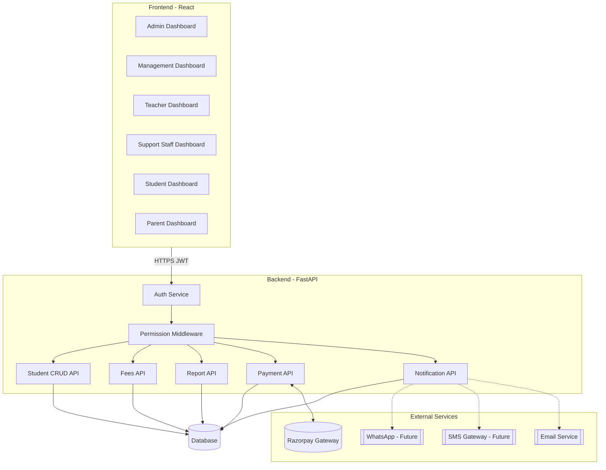
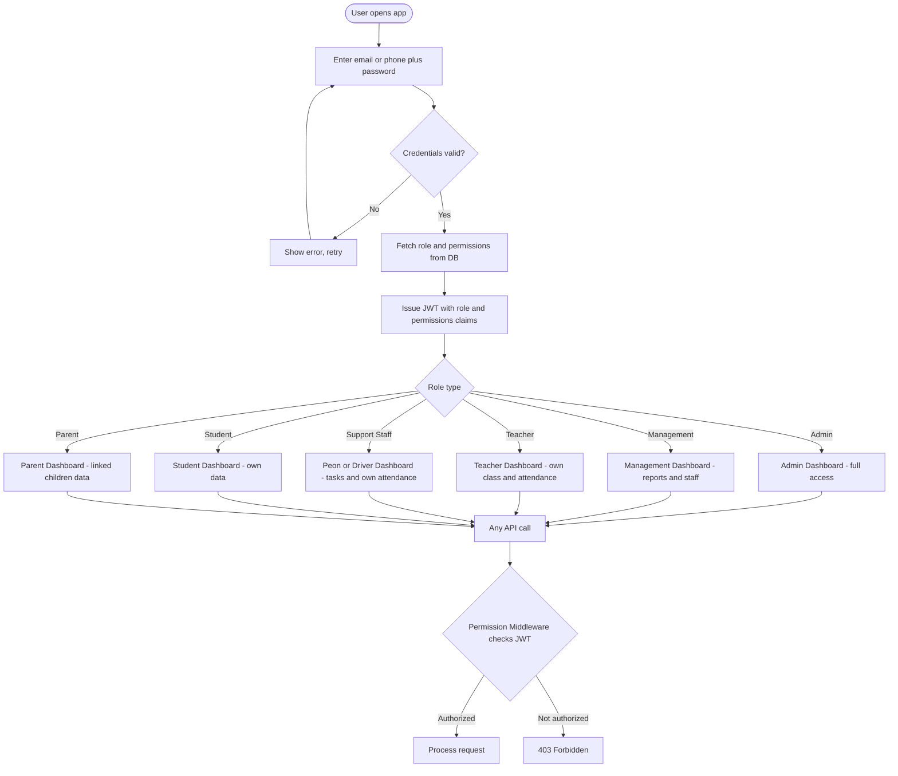
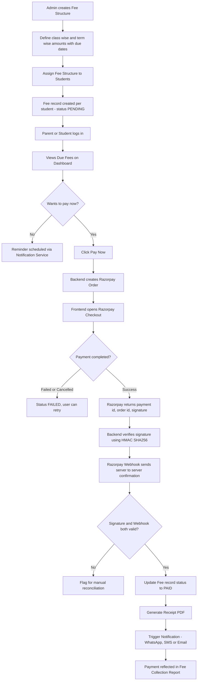
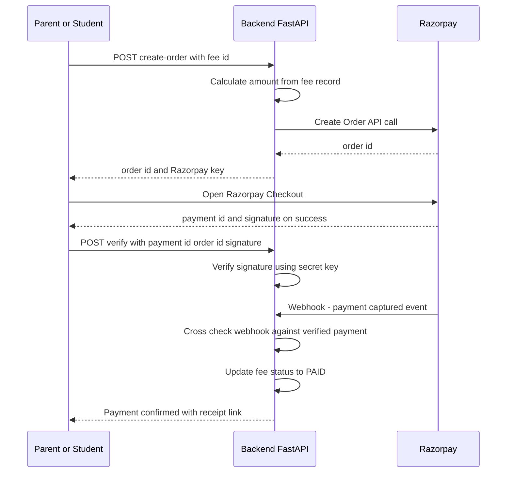
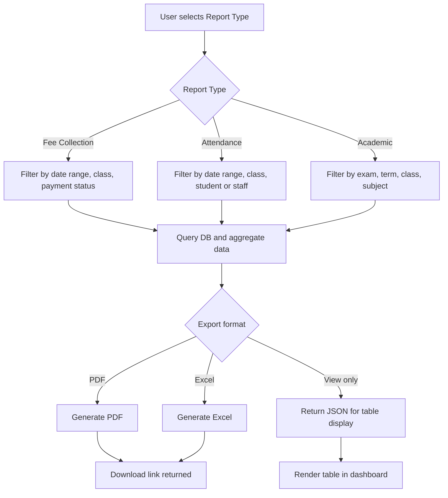
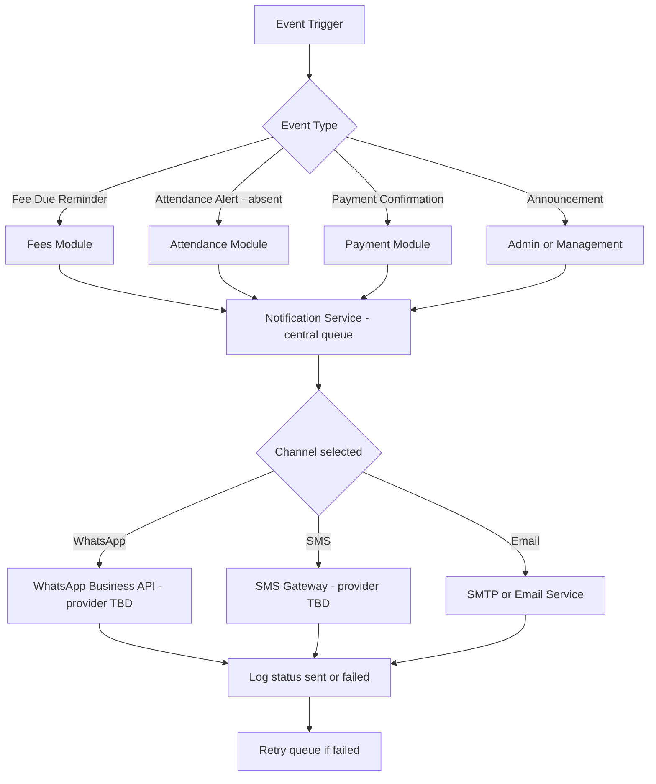

# School Management System — Architecture & Flow

This document maps the complete operational flow of the upgraded system — from authentication and role-based access, through fee collection and Razorpay payments, to reporting and notifications.

## Legend

| Shape | Meaning |
|-------|---------|
| Rounded | Start / End |
| Rectangle | Process / Step |
| Diamond | Decision point |
| Cylinder | Database |
| Double-bordered | External service |

---

## 1. System Architecture Overview

Frontend roles talk to one shared FastAPI backend behind an auth + permission layer. Every module writes to one shared database. Payment goes to Razorpay; notifications route out to WhatsApp, SMS, and Email once providers are finalized.

---

## 2. Login and Role-Based Access Flow

One login endpoint for all roles. JWT carries role + permissions, and every subsequent API call is checked against those permissions — not against hardcoded role names.

---

## 3. Fees Module — End to End Flow

Covers the full lifecycle: fee structure creation by Admin, assignment to students, payment initiation, Razorpay checkout, webhook-based confirmation, and receipt generation.

---

## 4. Razorpay Payment — Technical Sequence

Detailed request/response sequence between frontend, backend, and Razorpay — signature verification plus webhook cross-check means frontend confirmation alone is never trusted.

---

## 5. CRUD Operations Pattern (Student shown, same pattern for Fees, Users, every module)

```mermaid
flowchart TD
    subgraph CREATE["CREATE - POST"]
        C1[POST students] --> C2[Validate via StudentCreate schema]
        C2 --> C3{Valid?}
        C3 -->|No| C4[422 Validation Error]
        C3 -->|Yes| C5[Save to DB]
        C5 --> C6[201 Created plus StudentResponse]
    end

    subgraph READ["READ - GET"]
        R1[GET students or students by id] --> R2[Check Permission]
        R2 --> R3[Query DB with filters and pagination]
        R3 --> R4[200 OK plus StudentResponse]
    end

    subgraph UPDATE["UPDATE - PATCH"]
        U1[PATCH students by id] --> U2[Validate via StudentUpdate schema]
        U2 --> U3{Record exists?}
        U3 -->|No| U4[404 Not Found]
        U3 -->|Yes| U5[Update fields in DB]
        U5 --> U6[200 OK plus updated StudentResponse]
    end

    subgraph DELETE["DELETE"]
        D1[DELETE students by id] --> D2{Record exists?}
        D2 -->|No| D3[404 Not Found]
        D2 -->|Yes| D4[Soft delete - is_active false]
        D4 --> D5[204 No Content]
    end
```

Standard pattern reused across Student, Fees, Users, every module — schema validation, permission check, and proper HTTP status codes so Swagger docs stay accurate.

---

## 6. Report Generation Flow

Covers Fee Collection, Attendance, and Academic reports — filter, aggregate, export as PDF/Excel or view inline.

---

## 7. Notification Service Flow

One central queue triggered by events (fee due, absence, payment success, announcements). WhatsApp/SMS providers marked TBD since none finalized yet; Email can start immediately via SMTP.

---

## Next Steps
- ER diagram with full DB schema and relationships
- Module-wise API endpoint list (Swagger-ready)
- Existing website stack confirmation — needed before migration plan is finalized
